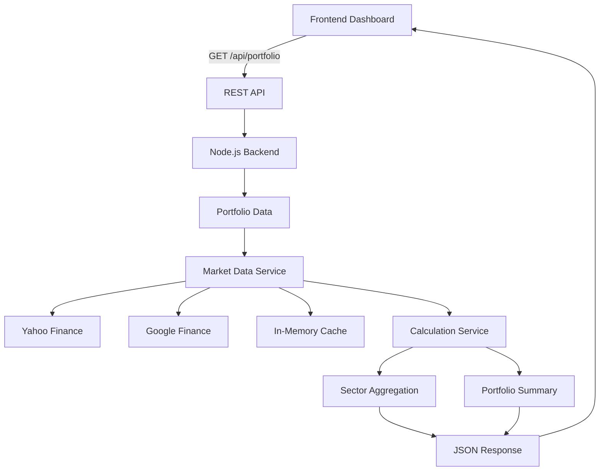

# Dynamic Portfolio Dashboard

## 1. Overview
The Dynamic Portfolio Dashboard is a full-stack web application built to fulfill the case study requirements for a portfolio analytics and visualization platform. It provides consolidated equity valuation, sector allocations, and mark-to-market performance insights by combining holding data normalized from the provided case-study Excel sheet with live market metrics scraped from external financial data providers. 

The application is meant for demonstration and portfolio analytics purposes, serving as a reliable read-only view of investments.

## 2. Features
- **Portfolio summary**: High-level KPIs at a glance.
  - Total Investment (Cost basis)
  - Present Value (Today's mark-to-market value)
  - Total Gain/Loss (Absolute value)
  - Overall Return (Percentage gain/loss)
- **Sector-wise grouping**: Dynamic aggregation of holdings by industry sectors.
  - Sector investment, present value, and gain/loss metrics.
- **Holdings table**: Detailed tabular breakdown of all portfolio assets.
  - Purchase Price, Quantity, Investment
  - Portfolio % (allocation weight)
  - NSE/BSE exchange tag
  - CMP (Current Market Price)
  - P/E Ratio
  - Latest Earnings (EPS)
- **Visual indicators**: Intuitive green/red text for positive/negative gains.
- **Real-time updates**: Automatic UI polling every 15 seconds.
- **Manual refresh**: Interactive refresh button for immediate updates.
- **Resilient UI**: Professional loading state skeletons and error state fallbacks.
- **Partial-data handling**: The application gracefully continues rendering even if some market data fields (like EPS or P/E) are unavailable.
- **Responsive design**: Tailwind-powered mobile, tablet, and desktop views.

## 3. Tech Stack

| Layer | Technologies |
| :--- | :--- |
| **Frontend** | Next.js (16.3.4), React (19.2.8), TypeScript, Tailwind CSS (v4) |
| **Backend** | Node.js, Express, TypeScript |
| **Data Providers** | Yahoo Finance (`yahoo-finance2`), Google Finance (Custom Scraper with `axios`) |
| **Other** | REST API, In-memory TTL caching, Jest (`jest`, `supertest`) |

## 4. Architecture

The application follows a clean client-server architecture with the backend acting as a data aggregation and calculation layer.



- **Frontend**: Responsible exclusively for presentation, periodic polling, and state management (loading/error handling).
- **Backend**: Responsible for loading the local JSON portfolio, orchestrating external market data requests concurrently, implementing fallback logic, managing the TTL cache, and performing all business logic calculations.

## 5. Data Flow
1. Frontend requests `/api/portfolio` on initial load.
2. The backend loads the portfolio holdings that were normalized from the provided Excel sheet into `portfolio.json`.
3. Backend checks its TTL cache for market data; on a miss, it concurrently requests Yahoo and Google Finance.
4. Yahoo Finance provides the CMP (Current Market Price).
5. Google Finance provides the P/E Ratio and Latest Earnings (EPS).
6. Backend applies fallback logic (using Yahoo for P/E or EPS if Google scraping fails) and handles partial-data failures.
7. Backend calculation service applies formulas to determine Investment, Present Value, Gain/Loss, and Portfolio %.
8. Holdings are aggregated into Sector summaries.
9. A fully structured JSON response is returned.
10. Frontend renders the dashboard components using the enriched data.
11. Frontend triggers an automatic background refresh approximately every 15 seconds.

## 6. API Documentation

### `GET /api/health`
Returns a simple 200 OK status to verify the server is running.

### `GET /api/portfolio`
The primary endpoint that returns the fully enriched portfolio data.

**Major Response Fields**:
- `success`: Boolean indicating if the request succeeded.
- `data.summary`: Top-level portfolio metrics (`totalInvestment`, `totalPresentValue`, `totalGainLoss`, `totalGainLossPercentage`).
- `data.sectors`: Array of aggregated sector data, each containing a `holdings` array.
- `data.holdings`: Flat array of all enriched holdings.
- `data.marketDataStatus`: High-level indicator (`success`, `partial`, `failed`) of the external provider health.
- `data.lastUpdated`: ISO timestamp of the response generation.

**Illustrative Response**:
```json
{
  "success": true,
  "data": {
    "summary": {
      "totalInvestment": 4850000,
      "totalPresentValue": 6184320,
      "totalGainLoss": 1334320,
      "totalGainLossPercentage": 27.51
    },
    "sectors": [
      {
        "name": "Financials",
        "totalInvestment": 1552000,
        "portfolioPercentage": 32.0,
        "holdings": [ /* ... */ ]
      }
    ],
    "holdings": [ /* ... */ ],
    "marketDataStatus": {
      "yahoo": "success",
      "google": "partial"
    },
    "lastUpdated": "2026-09-10T17:34:00.000Z"
  },
  "error": null
}
```

## 7. Portfolio Data Model

The static portfolio information (such as stock name, exchange, purchase price, quantity, and sector) originates from the case-study Excel sheet and is normalized into `portfolio.json`. The `EnrichedHolding` interface represents the core data model returned by the backend after combining this static data with live market metrics:

- `name`: Company name (string)
- `symbol`: Ticker symbol (string)
- `sector`: Industry sector (string)
- `exchange`: `NSE` or `BSE`
- `purchasePrice`: Original buy price (number)
- `quantity`: Number of shares (number)
- `investment`: Total cost basis (number)
- `portfolioPercentage`: Weight in the total portfolio (number)
- `cmp`: Current Market Price from Yahoo Finance (number | null)
- `presentValue`: Current total value (number | null)
- `gainLoss`: Absolute profit or loss (number | null)
- `gainLossPercentage`: Percentage profit or loss (number | null)
- `peRatio`: Price-to-Earnings ratio from Google Finance (number | null)
- `latestEarnings`: Earnings per share (EPS) from Google Finance (number | null)

## 8. Calculations

The backend Calculation Service implements the following formulas:

- **Investment** = `Purchase Price × Quantity`
- **Present Value** = `CMP × Quantity`
- **Gain/Loss** = `Present Value − Investment`
- **Portfolio %** = `(Individual Investment / Total Portfolio Investment) × 100`

Sector totals are calculated by summing the `investment`, `presentValue`, and `gainLoss` of all individual holdings that belong to that specific sector.

## 9. External API Strategy

Neither Yahoo Finance nor Google Finance provide an official, public API intended for free high-frequency programmatic use. To satisfy the case study:

- **Yahoo Finance** (`yahoo-finance2` library): Primary source for CMP and fallback source for P/E and EPS when Google Finance data is unavailable.
- **Google Finance** (Custom HTML scraping): Primary source for P/E Ratio and Latest Earnings (EPS).
- **Fallback Behavior**: If Google Finance scraping fails or returns incomplete data, Yahoo Finance provides fallback P/E/EPS values where available.
- **Partial Failure**: If a metric cannot be found on either provider, it safely resolves to `null`, and the provider status is marked as `partial`.

*Note: Because Google Finance relies on DOM scraping, structural changes to Google's HTML may affect extraction accuracy over time.*

## 10. Caching and Rate Limiting

An in-memory TTL (Time-To-Live) cache is implemented at the Market Data Service layer.

- **Implementation**: The cache stores the `CombinedMarketData` payload per stock symbol.
- **Configuration**: The TTL is configured via `MARKET_DATA_CACHE_TTL` in the environment variables, defaulting to `60000` ms (60 seconds).
- **Purpose**:
  - Reduces redundant outbound network requests.
  - Lowers the risk of IP bans or rate-limiting by Yahoo/Google.
  - Drastically improves backend response times.
  - Allows the frontend to safely poll every 15 seconds for UI responsiveness without hammering external servers.

## 11. Error Handling

The application is designed to be highly fault-tolerant:
- **Provider Failure**: Handled via `Promise.allSettled`. If Yahoo fails, Google still runs, and vice-versa.
- **Partial Data**: Missing fields (like P/E or EPS) are explicitly typed as `number | null`. The frontend detects `null` and safely renders `"N/A"`.
- **Missing CMP**: If CMP is unavailable, `presentValue` and `gainLoss` mathematically cascade to `null`, avoiding NaN bugs in the UI.
- **API Failure**: If the backend completely crashes or is unreachable, the frontend displays a dedicated `ErrorState` UI block with a "Try Again" mechanism.
- **Loading State**: A comprehensive `LoadingSkeleton` guarantees UI stability during slow network requests.

## 12. Project Structure

```text
8Byte/
├── backend/
│   ├── api/
│   │   └── index.ts          # Vercel serverless entry point
│   ├── data/
│   │   └── portfolio.json    # Normalized portfolio data from provided Excel sheet
│   ├── src/
│   │   ├── controllers/      # Express route handlers
│   │   ├── providers/        # Yahoo and Google integration logic
│   │   ├── services/         # Market data fetching and calculations
│   │   ├── types/            # TypeScript interfaces
│   │   └── utils/            # Cache, Logger, Math utilities
│   ├── package.json
│   ├── tsconfig.json
│   ├── vercel.json           # Vercel deployment configuration
│   └── .env.example
├── frontend/
│   ├── src/
│   │   ├── app/              # Next.js App Router (layout, page)
│   │   ├── components/       # Reusable React components (Header, Table, Cards)
│   │   ├── hooks/            # usePortfolio custom hook for polling
│   │   ├── lib/              # API fetch and formatting utilities
│   │   └── types/            # Shared interfaces mirroring backend
│   ├── package.json
│   └── .env.local
└── README.md
```

## 13. Installation

Ensure you have Node.js (v20+) installed. Clone the repository and install dependencies for both layers.

**Backend Setup**:
```bash
cd backend
npm install
```
The backend uses default environment variables that work out of the box (`PORT=5000`, `MARKET_DATA_CACHE_TTL=60000`). If you wish to override them, copy `.env.example` to `.env`.

**Frontend Setup**:
```bash
cd frontend
npm install
```
Local environment files like `.env.local` are intentionally ignored by git. You should configure environment variables locally or through Vercel project settings. For local development, create a `.env.local` with `NEXT_PUBLIC_API_URL=http://localhost:5000` to connect to the backend.

## 14. Deployment

Both the frontend and backend are fully configured for Vercel deployment.

- **Backend**: Deployable directly from the `backend` root directory. The `backend/api/index.ts` serves as the Vercel serverless entry point, while `backend/vercel.json` handles routing and explicitly includes `portfolio.json` in the bundle.
- **Frontend**: Deployable directly from the `frontend` root directory. Ensure you set the `NEXT_PUBLIC_API_URL` environment variable in your Vercel project settings to point to your deployed backend URL.

## 15. Running the Application

Both the backend and frontend must be running concurrently.

**Start the Backend**:
```bash
cd backend
npm run dev
```
The REST API will be available at: `http://localhost:5000`

**Start the Frontend**:
```bash
cd frontend
npm run dev
```
The Dashboard UI will be available at: `http://localhost:3000`

## 16. Testing

The backend is covered by automated tests for calculation logic, caching, provider behavior, error handling, and API integration.

**Run Backend Tests**:
```bash
cd backend
npm test
npm run typecheck
npm run build
```
*Result*: 85 backend tests passing successfully.

**Run Frontend Verification**:
```bash
cd frontend
npm run build
```
*Result*: Clean compilation and successful static Next.js production build (Next.js automatically performs TypeScript checking during the build).

## 17. Design and UX

The frontend was modeled using Google Stitch and implemented accurately in React + Tailwind CSS:
- **Single-page dashboard**: Clean, vertical layout requiring no complex navigation.
- **Summary cards**: High-priority KPI visualization.
- **Sector allocation**: Visual progress bar indicating portfolio weight distribution.
- **Holdings table**: Tabular grouping by sector for dense data consumption.
- **Visual indicators**: Text dynamically turns green (`text-emerald-600`) or red (`text-rose-600`) based on gain/loss value.
- **Responsive layout**: Fully functional on mobile, tablet, and desktop screens.

## 18. Technical Challenges and Solutions

- **Unofficial Data Sources**: Handled gracefully by using `Promise.allSettled`, robust Regex string cleaning (removing `₹`, commas), and creating a multi-tiered fallback system.
- **Rate Limiting & Performance**: Mitigated by a 60-second in-memory TTL cache. This reduces repeated external requests for cached symbols and allows 15-second frontend polling without fetching fresh provider data on every poll.
- **Partial Data**: Solved at the TypeScript layer by strictly enforcing `number | null` across the Calculation Service and Frontend, ensuring zero runtime crashes from missing provider data.
- **Periodic Updates**: Handled efficiently on the client via a custom `usePortfolio` React hook relying on standard `setInterval` polling with proper `useEffect` cleanup.

## 19. Limitations

- **Unofficial Integration**: Yahoo Finance and Google Finance integrations rely on unofficial library wrappers and direct DOM scraping. Structural updates to Google's website will break the EPS/PE extraction logic.
- **Market Data Availability**: Niche BSE stocks or newly listed equities may not resolve accurately on external providers, leading to partial data rendering.
- **Not for Trading**: This is strictly a read-only portfolio analytics visualization dashboard, not a high-frequency trading or execution system.

## 20. Future Improvements

- **WebSocket/SSE**: Replace 15-second polling with Server-Sent Events (SSE) or WebSockets for true push-based reactivity.
- **Persistent Cache**: Upgrade the in-memory cache to Redis to maintain state across backend server restarts.
- **Database Integration**: Migrate `portfolio.json` to a PostgreSQL or MongoDB instance to allow users to dynamically add/remove holdings.
- **Historical Charts**: Implement Recharts or Chart.js to visualize portfolio growth over a 1Y or 5Y historical window.

## 21. Disclaimer

*Market data provided in this dashboard may be delayed, incomplete, or unavailable depending on the health of third-party external providers. This application is constructed strictly for demonstration and technical evaluation purposes. It does not constitute financial advice.*
