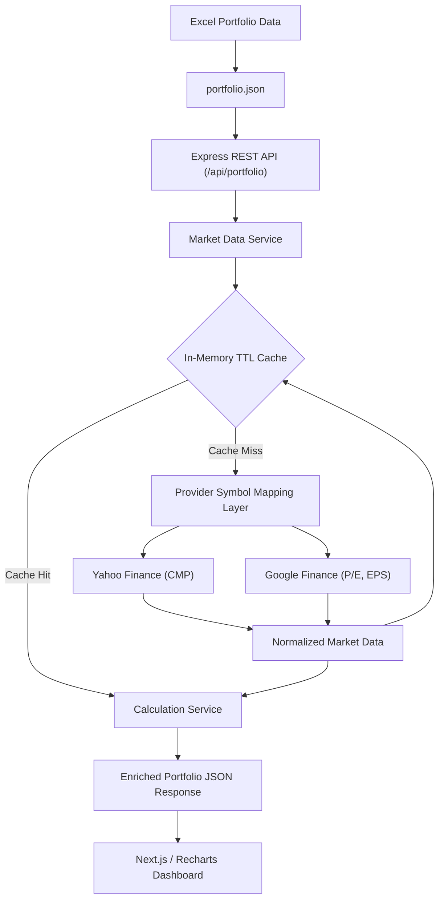

# Dynamic Portfolio Dashboard

A modern, production-ready portfolio analytics and valuation web application built for Indian equity holdings. The dashboard combines static portfolio holdings from an authoritative Excel dataset with real-time market metrics dynamically fetched from financial data providers, delivering mark-to-market valuations, sector allocations, and performance insights.

Built using:
- **Next.js / React**
- **TypeScript**
- **Tailwind CSS**
- **Node.js / Express**
- **Yahoo Finance**
- **Google Finance**
- **Recharts**

---

## Features

- **26 Active Portfolio Holdings**: Accurately tracks all 26 active investments from the authoritative Excel portfolio source.
- **Portfolio Grouped by Sector**: Logical categorization across 6 distinct industry segments with sector-level sub-totals.
- **Key Portfolio Metrics**:
  - **Total Investment**: Consolidated capital cost basis (₹15,43,060.00).
  - **Present Value**: Dynamic mark-to-market portfolio valuation.
  - **Total Gain/Loss**: Absolute profit or loss in INR.
  - **Overall Return**: Net portfolio percentage return with color indicators.
- **Portfolio Allocation by Sector**: Interactive Recharts donut visualization and visual progress bars depicting asset distribution weights.
- **Live Market Data**:
  - **CMP (Current Market Price)**: Last traded prices dynamically fetched from Yahoo Finance.
  - **P/E Ratio**: Valuation multiples scraped from Google Finance with Yahoo Finance fallback.
  - **Latest Earnings / EPS**: Trailing 12-month earnings per share from Google Finance with Yahoo Finance fallback.
- **Gain/Loss Color Indication**: Contextual green (`text-emerald-600`) and red (`text-rose-600`) styling for positive and negative performance.
- **15-Second Automated Polling**: Background refresh mechanism keeping the dashboard up-to-date.
- **Manual Refresh**: Interactive header control for immediate data reload with spinning indicator.
- **Partial Market-Data Handling**: Resilient handling ensuring that missing metrics for an individual stock gracefully display as `"N/A"` without disrupting the rest of the portfolio.
- **In-Memory Caching & Throttling**: Backend per-symbol TTL cache preventing rate limits and excessive provider queries.
- **Provider Fallback**: Intelligent cascade to secondary providers if primary scrapers encounter missing fields.
- **Dynamic Sector Totals**: Real-time aggregation of investment, present value, and gain/loss per sector.
- **Loading & Error States**: Tailored skeleton screens during initial load and an error boundary with retry triggers if the API is unreachable.
- **Responsive Dashboard**: Fully fluid layout optimized across mobile, tablet, and widescreen desktop monitors.

---

## Technology Stack

### Frontend
- **Framework**: [Next.js](https://nextjs.org/) (v16.3.4 App Router)
- **UI Library**: [React](https://react.dev/) (v19.2.8)
- **Language**: [TypeScript](https://www.typescriptlang.org/) (v5)
- **Styling**: [Tailwind CSS](https://tailwindcss.com/) (v4)
- **Visualizations**: [Recharts](https://recharts.org/) (v3.10.1)

### Backend
- **Runtime**: [Node.js](https://nodejs.org/) (v20+)
- **Framework**: [Express](https://expressjs.com/) (v4.19.2)
- **Language**: [TypeScript](https://www.typescriptlang.org/) (v5)
- **HTTP Client**: [Axios](https://axios-http.com/) (v1.7.2) for Google Finance scraping
- **Market Provider**: [`yahoo-finance2`](https://github.com/gadicc/yahoo-finance2) (v4.0.2)

### Testing & Tooling
- **Test Runner**: [Jest](https://jestjs.io/) (v29.7.0) with `ts-jest`
- **Integration Testing**: [Supertest](https://github.com/ladjs/supertest) (v7.2.2)

---

## Architecture

The system decouples the presentation layer from market data aggregation, caching, and financial calculations:



### Identifier Separation

Portfolio identifiers are intentionally decoupled from third-party provider ticker symbols:
- **Portfolio Identifiers**: Preserve the authentic exchange-assigned identifier (`HDFCBANK`, `LTIM`, `DMART`, `ASTRAL` for NSE; `532174`, `544252`, `511577` for BSE).
- **Provider Tickers**: Formatted specifically for Yahoo Finance and Google Finance ingestion. Suffixes like `.NS` and `.BO` are strictly internal to the provider layer and are never displayed as user-facing portfolio identifiers in the table.

Examples:
- **NSE**: `HDFCBANK` $\rightarrow$ Provider: `HDFCBANK.NS`
- **BSE**: `532174` (ICICI Bank) $\rightarrow$ Provider: `ICICIBANK.BO`
- **NSE Override**: `LTIM` (LTI Mindtree) $\rightarrow$ Provider: `LTM.NS`
- **BSE Numeric**: `511577` (Savani Financials) $\rightarrow$ Provider: `511577.BO`

---

## Portfolio Data

The dashboard dataset contains the **26 active holdings** from the Excel source.

### Sector Distribution

| Sector | Holdings Count | Cost Basis (Investment) |
| :--- | :---: | :---: |
| **Financial Sector** | 5 | ₹3,28,450.00 |
| **Technology** | 6 | ₹3,37,820.00 |
| **Consumer** | 3 | ₹2,63,565.00 |
| **Power** | 4 | ₹1,58,860.00 |
| **Pipe Sector** | 3 | ₹1,98,656.00 |
| **Others** | 5 | ₹2,55,709.00 |
| **Total** | **26** | **₹15,43,060.00** |

*Note: Purchase price, quantity, investment, sector, exchange, and exchange identifier are stored as portfolio static data in `portfolio.json`. Live CMP, valuation, gain/loss, P/E, and EPS values are fetched and calculated dynamically.*

---

## Market Data Providers

### Yahoo Finance
- **Primary Responsibility**: Current Market Price (CMP) via `quote.regularMarketPrice`.
- **Supplementary Data**: Serves as the automated fallback for P/E (`quote.trailingPE`) and TTM EPS (`quote.epsTrailingTwelveMonths`).
- **Integration**: Utilizes the `yahoo-finance2` community library wrapper around Yahoo Finance endpoints.

### Google Finance
- **Primary Responsibility**: Price-to-Earnings Ratio (`P/E ratio`) and Latest Earnings (`EPS`).
- **Integration**: Executes custom HTTP requests using `axios` with desktop browser user-agent headers, extracting structured metrics from HTML via target element regex patterns.

### Provider Fallback & Graceful Degradation
- If Google Finance fails or returns incomplete metrics for a stock, the system automatically falls back to Yahoo Finance's trailing P/E and TTM EPS.
- When an individual metric is not supplied by either provider, the field is assigned `null` and displayed in the frontend as `"N/A"` rather than inventing false data.
- Market data fetch calls are isolated via `Promise.allSettled`, ensuring that a failure or timeout on one security never breaks the remaining 25 holdings.

---

## Provider Symbol Mapping

External providers do not adhere to standardized symbol naming:
1. **NSE Equities**: Standard symbols are mapped to Yahoo `.NS` tickers (`HDFCBANK.NS`, `AFFLE.NS`, `DMART.NS`, `ASTRAL.NS`).
2. **Yahoo Ticker Aliases**: Special tickers such as LTI Mindtree (`LTIM`) map to Yahoo's specific symbol `LTM.NS`.
3. **BSE Scrip Codes**: Numeric BSE codes are translated into their respective Yahoo BSE tickers (`532174` $\rightarrow$ `ICICIBANK.BO`, `544252` $\rightarrow$ `BAJAJHFL.BO`, `542651` $\rightarrow$ `KPITTECH.BO`, `511577` $\rightarrow$ `511577.BO`).

This mapping layer isolates third-party provider idiosyncrasies from the core domain model and table UI.

---

## Dynamic Updates and Caching

- **Frontend Polling**: The React client polls `GET /api/portfolio` approximately every 15 seconds.
- **In-Memory TTL Cache**: The backend uses an in-memory cache with a configurable Time-To-Live (default: `60000` ms / 60 seconds).
- **Reduced Latency & Throttling**: Cached responses avoid unnecessary external provider requests and reduce backend and provider load while mitigating external IP rate-limiting.
- **Failed Request Short-TTL**: Entries with completely failed upstream market data expire quickly (5 seconds) so transient network glitches recover promptly.

---

## Calculations

The Calculation Service implements standard financial formulas:

- **Investment**:
  $$\text{Investment} = \text{Purchase Price} \times \text{Quantity}$$
- **Present Value**:
  $$\text{Present Value} = \text{CMP} \times \text{Quantity}$$
- **Gain / Loss**:
  $$\text{Gain / Loss} = \text{Present Value} - \text{Investment}$$
- **Gain / Loss %**:
  $$\text{Gain / Loss \%} = \left(\frac{\text{Gain / Loss}}{\text{Investment}}\right) \times 100$$
- **Portfolio %**:
  $$\text{Portfolio \%} = \left(\frac{\text{Investment}}{\text{Total Portfolio Investment}}\right) \times 100$$
- **Sector Totals**:
  Sum of all holdings belonging to that sector for investment, present value, and gain/loss.

*If CMP is `null` (unavailable), `presentValue`, `gainLoss`, and `gainLossPercentage` cascade safely to `null`, preventing `NaN` rendering bugs in the UI.*

---

## API Documentation

### `GET /api/health`
Health check endpoint verifying that the service is operational.

**Response**:
```json
{
  "status": "ok",
  "service": "portfolio-api",
  "timestamp": "2026-09-12T14:40:00.000Z"
}
```

### `GET /api/portfolio`
Returns the enriched portfolio data, including summaries, sector aggregations, and individual holdings.

**Illustrative Response Structure**:
```json
{
  "success": true,
  "data": {
    "summary": {
      "totalInvestment": 1543060,
      "totalPresentValue": 1486497.24,
      "totalGainLoss": -56562.76,
      "totalGainLossPercentage": -3.67
    },
    "sectors": [
      {
        "name": "Technology",
        "totalInvestment": 337820,
        "totalPresentValue": 328900.5,
        "gainLoss": -8919.5,
        "gainLossPercentage": -2.64,
        "portfolioPercentage": 21.89,
        "holdings": [ /* ... */ ]
      }
    ],
    "holdings": [
      {
        "id": "hdfc-bank",
        "name": "HDFC Bank",
        "symbol": "HDFCBANK",
        "exchange": "NSE",
        "sector": "Financial Sector",
        "purchasePrice": 1490,
        "quantity": 50,
        "investment": 74500,
        "portfolioPercentage": 4.83,
        "cmp": 708.25,
        "presentValue": 35412.5,
        "gainLoss": -39087.5,
        "gainLossPercentage": -52.47,
        "peRatio": 13.84,
        "latestEarnings": 51.21,
        "dataStatus": {
          "yahoo": "success",
          "google": "success"
        }
      }
    ],
    "marketDataStatus": {
      "yahoo": "success",
      "google": "partial"
    },
    "lastUpdated": "2026-09-12T14:40:00.000Z"
  },
  "error": null
}
```

---

## Local Setup

### Prerequisites
- Node.js (v20 or newer)
- npm (v10 or newer)

### 1. Backend Setup
```bash
cd backend
npm install
npm run dev
```
The backend API server will start on `http://localhost:5000`.

**Backend Environment Variables** (`backend/.env` or defaults):
| Variable | Default | Description |
| :--- | :--- | :--- |
| `PORT` | `5000` | Port for the Express server |
| `NODE_ENV` | `development` | Runtime environment (`development` / `production`) |
| `FRONTEND_URL` | `http://localhost:3000` | Allowed CORS origin |
| `MARKET_DATA_CACHE_TTL` | `60000` | Market data cache TTL in milliseconds |
| `YAHOO_TIMEOUT` | `8000` | Outbound timeout for Yahoo Finance in milliseconds |
| `GOOGLE_TIMEOUT` | `8000` | Outbound timeout for Google Finance in milliseconds |

### 2. Frontend Setup
```bash
cd frontend
npm install
npm run dev
```
The Next.js client will start on `http://localhost:3000`.

**Frontend Environment Variables** (`frontend/.env.local`):
| Variable | Default | Description |
| :--- | :--- | :--- |
| `NEXT_PUBLIC_API_URL` | `http://localhost:5000` | Base URL of the backend REST API |

---

## Testing & Verification

The backend test suite verifies calculations, caching mechanics, provider handling, and endpoint reliability:

```bash
# Backend Testing & Typechecking
cd backend
npm run test        # Runs 85 unit and integration tests across 6 test suites
npm run typecheck   # Validates TypeScript compilation without emitting files
npm run build       # Validates production compilation and asset copying

# Frontend Production Build
cd ../frontend
npm run build       # Executes Next.js static build and TypeScript type-checking
```

**Verified Test Summary**:
- **Backend**: 6 test suites passed, 85 tests passed, 0 failures.
- **Frontend**: Clean static optimization and build passing with 0 errors.

---

## Deployment

The application is deployed on Vercel as two decoupled services:

- **Frontend**: [https://portfolio-dashboard-swart-zeta.vercel.app](https://portfolio-dashboard-swart-zeta.vercel.app)
- **Backend API**: [https://portfolio-dashboard-backend-ebon.vercel.app](https://portfolio-dashboard-backend-ebon.vercel.app)

The deployed frontend communicates directly with the deployed backend using the production `NEXT_PUBLIC_API_URL` environment variable configured in Vercel.

---

## Project Structure

```text
8Byte/
├── backend/
│   ├── src/
│   │   ├── controllers/            # Express route controllers (portfolio, health)
│   │   ├── data/
│   │   │   └── portfolio.json      # Authoritative 26 active Excel holdings
│   │   ├── middleware/             # Error handling, 404, request logging
│   │   ├── providers/              # Yahoo and Google market data providers
│   │   ├── routes/                 # Express route definitions
│   │   ├── services/               # Market data orchestrator & calculation service
│   │   ├── types/                  # TypeScript domain interfaces
│   │   ├── utils/                  # Cache, Logger, Math calculation helpers
│   │   ├── app.ts                  # Express app factory & CORS configuration
│   │   └── server.ts               # HTTP server listener & graceful shutdown
│   ├── package.json
│   ├── tsconfig.json
│   └── .env.example
├── frontend/
│   ├── public/                     # Static assets & icons
│   ├── src/
│   │   ├── app/                    # Next.js App Router (layout, page)
│   │   ├── components/             # Reusable UI components
│   │   │   ├── DashboardHeader.tsx # Sub-header with metrics and badges
│   │   │   ├── ErrorState.tsx      # Error fallback UI with retry button
│   │   │   ├── Header.tsx          # Top bar with refresh controls
│   │   │   ├── HoldingsTable.tsx   # Interactive sector-grouped holdings table
│   │   │   ├── LoadingSkeleton.tsx # Skeleton UI for initial load
│   │   │   ├── SectorAllocation.tsx# Recharts donut chart & sector breakdown
│   │   │   └── SummaryCards.tsx    # High-level KPI summary cards
│   │   ├── hooks/
│   │   │   └── usePortfolio.ts     # Custom hook for polling and state management
│   │   ├── lib/
│   │   │   ├── api.ts              # Fetch wrapper with error handling
│   │   │   └── utils.ts            # INR currency and percentage formatters
│   │   └── types/
│   │       └── portfolio.ts        # Client-side TypeScript interfaces
│   ├── package.json
│   └── tsconfig.json
├── TECHNICAL_DOCUMENT.md           # In-depth technical architecture document
└── README.md                       # Root project documentation
```

---

## Limitations

1. **Unofficial API Reliance**: Yahoo Finance and Google Finance do not provide official public APIs for this use case. Upstream HTML or internal endpoint changes can alter response shapes.
2. **Variable Security Coverage**: Smaller-cap BSE stocks may have delayed or missing metrics on third-party platforms.
3. **Legitimate N/A Values**: Incomplete metrics are returned as `null` / `"N/A"` by design to maintain truthful reporting without inventing synthetic data.
4. **Read-Only Scope**: The dashboard serves analytics and valuation visualization purposes; it does not execute live trading orders.

---

## Security Considerations

- **Strict CORS Policy**: The Express backend restricts cross-origin resource sharing to the configured frontend origin (`FRONTEND_URL`).
- **Environment Separation**: Secrets and dynamic URLs are managed exclusively via environment variables; no credentials or API keys are committed to source control.
- **Request Timeouts**: All upstream HTTP requests are guarded with strict timeouts (`YAHOO_TIMEOUT`, `GOOGLE_TIMEOUT`) to prevent connection exhaustion.
- **Runtime Data Validation**: Incoming portfolio JSON is validated at service startup (checking non-empty required strings, valid "NSE"/"BSE" exchange identifiers, positive finite purchase prices, positive integer quantities, and unique symbols).
- **Graceful Error Sanitization**: Internal server errors return standardized envelope payloads with scrubbed messages, preventing internal stack trace leaks.

---

## Design Decisions

- **Separation of Portfolio Identifiers & Provider Tickers**: Preserves Excel exchange identifiers for domain purity while translating internally for third-party scrapers.
- **Backend Aggregation vs. Direct Client Scraping**: Prevents client-side CORS blocking, hides scraping logic from the browser, and consolidates caching in one location.
- **In-Memory TTL Caching**: Cached responses avoid unnecessary external provider requests and reduce backend and provider load during 15-second client polling without introducing external infrastructure complexity.
- **Partial-Failure Fault Tolerance**: Uses `Promise.allSettled` so that an upstream provider failure on a single security never interrupts the valuation of the remaining portfolio.
- **Recharts Donut Visualization**: Implements distinct, accessible color coding mapped by sector name to provide instant visual clarity on asset allocation.
