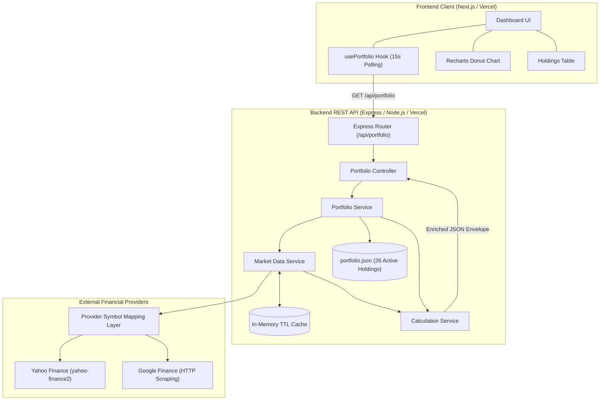
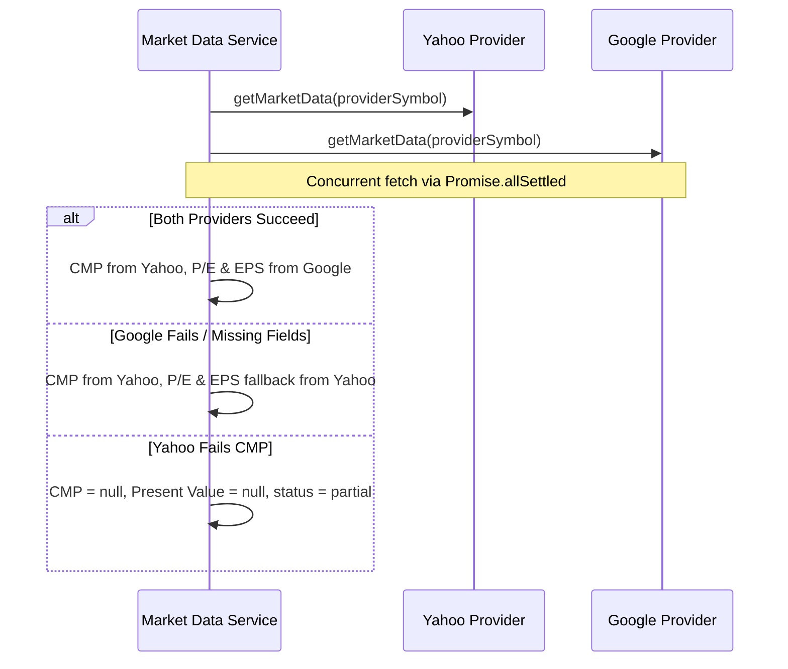

# Technical Document — Dynamic Portfolio Dashboard

**Author**: Mradul Mahajan  
**Project**: Dynamic Portfolio Dashboard  
**Date**: September 2026  
**Repository**: [GitHub Repository](https://github.com/Mradul-2604/PortfolioDashboard)  
**Live Frontend**: [https://portfolio-dashboard-swart-zeta.vercel.app](https://portfolio-dashboard-swart-zeta.vercel.app)  
**Live Backend API**: [https://portfolio-dashboard-backend-ebon.vercel.app](https://portfolio-dashboard-backend-ebon.vercel.app)  

---

## 1. Executive Summary

The **Dynamic Portfolio Dashboard** is an enterprise-grade, full-stack financial analytics application engineered to track, analyze, and visualize equity holdings in the Indian stock market (NSE and BSE). Built to address the requirements of the portfolio analytics case study, the application bridges static holding data extracted from an authoritative Excel investment portfolio with real-time financial metrics sourced from third-party market data providers.

The platform delivers mark-to-market portfolio valuations, industry sector allocations, and company fundamental ratios (P/E and EPS). It features automated 15-second client polling, resilient multi-provider fallback orchestration, in-memory TTL caching, and a responsive user interface powered by Next.js, React, Tailwind CSS, and Recharts.

---

## 2. Requirements Implemented

The application satisfies all functional and non-functional specifications defined in the case study:

| Requirement Category | Specification | Implementation Details |
| :--- | :--- | :--- |
| **Portfolio Scope** | 26 Active Holdings | Normalized from the Excel source, excluding exited/sold securities. |
| **Sector Grouping** | Categorized Breakdown | Grouped into 6 sectors: Financial Sector, Technology, Consumer, Power, Pipe Sector, Others. |
| **Financial Calculations** | Core Valuation Metrics | Computes Investment, Present Value, Absolute Gain/Loss, Overall Return %, and Portfolio Weight %. |
| **Real-Time Market Data** | Live CMP, P/E, EPS | Real-time prices via Yahoo Finance; P/E and EPS via Google Finance with Yahoo fallback. |
| **Automated Polling** | ~15-Second Refresh | Custom React hook (`usePortfolio`) executing lifecycle-managed periodic updates. |
| **Visual Indicators** | Color-Coded Performance | Distinct green (`text-emerald-600`) and red (`text-rose-600`) indicators for positive/negative gains. |
| **Data Visualizations** | Sector Allocation Chart | Interactive Recharts Donut Chart with a consistent, accessible sector color mapping. |
| **Fault Tolerance** | Partial Data Handling | Gracefully renders `"N/A"` when metrics are unavailable without breaking the portfolio. |
| **Caching & Throttling** | In-Memory TTL Cache | 60-second configurable TTL to prevent API rate limits and minimize server latency. |
| **Responsive UI** | Mobile / Tablet / Desktop | Fluid Tailwind CSS layout with loading skeletons and dedicated error recovery states. |

---

## 3. System Architecture

The application adopts a decoupled client-server architecture. The frontend handles state management and user interaction, while the backend is an Express-based calculation engine and data aggregation layer.



### Key Architectural Principles
1. **Domain Purity**: Portfolio holdings store genuine exchange identifiers (`HDFCBANK`, `532174`) without provider-specific artifacts like `.NS` or `.BO`.
2. **Provider Isolation**: Third-party scraping mechanisms and library dependencies are isolated behind the `MarketDataProvider` interface.
3. **Resilience by Default**: Asynchronous fetches utilize `Promise.allSettled` to prevent single-point failures.
4. **Reduced Latency & Provider Load**: In-memory caching ensures that frequent client polling does not saturate external providers, avoiding redundant outbound requests.

---

## 4. Frontend Design

The frontend application is built on **Next.js 16.3.4** utilizing React 19 and Tailwind CSS v4.

### Component Hierarchy
```text
src/app/page.tsx
├── Header.tsx                 (Title, Manual Refresh button, Last Updated timestamp)
├── DashboardHeader.tsx        (Page heading, Total Holdings badge, Market status)
├── SummaryCards.tsx           (4 KPI cards: Total Investment, Present Value, Gain/Loss, Overall Return)
├── SectorAllocation.tsx       (Recharts Donut Chart, 100% Center Label, Progress Bar, Legend Cards)
├── HoldingsTable.tsx          (Sector-grouped table with sort, badges, and financial metrics)
├── LoadingSkeleton.tsx        (Skeleton loader displayed during initial data fetch)
└── ErrorState.tsx             (Fallback screen with user retry trigger)
```

### State Management & Polling
Client-side lifecycle and polling are encapsulated within the custom hook `usePortfolio(pollingIntervalMs = 15000)`:
- **Immediate Initial Fetch**: Executes upon component mount to populate the dashboard.
- **Interval Polling**: Employs `setInterval` with automated cleanup (`clearInterval`) upon component unmount to prevent memory leaks.
- **Manual Refresh Lock**: Implements an `isRefreshing` state to debounce user clicks and prevent duplicate in-flight network requests.
- **Silent Background Updates**: Subsequent polls update data seamlessly without flashing the full-screen skeleton loader.

---

## 5. Backend Architecture

The backend is developed with **Node.js**, **Express**, and **TypeScript**, enforcing strict modularity:

```text
backend/src/
├── controllers/
│   ├── portfolio.controller.ts  # Handles GET /api/portfolio requests and envelope formatting
│   └── health.controller.ts     # Health check handler
├── data/
│   └── portfolio.json           # Canonical dataset of the 26 active Excel holdings
├── middleware/
│   ├── error.middleware.ts      # Global error filter returning sanitized JSON envelopes
│   └── not-found.middleware.ts  # Standardized 404 response handler
├── providers/
│   ├── yahoo.provider.ts        # Integration with yahoo-finance2 for CMP and fallbacks
│   └── google.provider.ts       # HTML scraping engine for P/E and EPS
├── routes/
│   ├── portfolio.routes.ts      # Route declarations for portfolio endpoints
│   └── health.routes.ts         # Route declarations for health endpoints
├── services/
│   ├── portfolio.service.ts     # Orchestrates data loading, market fetching, and calculations
│   ├── market-data.service.ts   # Concurrency orchestrator, TTL cache, provider mapping
│   └── calculation.service.ts   # Pure business logic and financial mathematics
├── types/
│   ├── portfolio.types.ts       # Domain interfaces (Holding, EnrichedHolding, SectorSummary)
│   └── market-data.types.ts     # Provider interfaces and market data payloads
├── utils/
│   ├── cache.ts                 # Generic in-memory TTL cache
│   ├── calculations.ts          # Individual mathematical formulas with unit rounding
│   └── logger.ts                # Structured logger with context tags
├── app.ts                       # Express application factory and CORS configuration
└── server.ts                    # HTTP server binding and graceful shutdown handlers
```

---

## 6. Market Data Integration

To fulfill the requirements without incurring enterprise data feed costs, the system integrates two complementary market data sources:

### 1. Yahoo Finance (`yahoo.provider.ts`)
- **Role**: Primary provider for Current Market Price (CMP) via `quote.regularMarketPrice`.
- **Secondary Role**: Automatic fallback provider for trailing P/E (`quote.trailingPE`) and TTM EPS (`quote.epsTrailingTwelveMonths`).
- **Implementation**: Utilizes `yahoo-finance2` with notice suppression and custom timeout controls (`YAHOO_TIMEOUT = 8000ms`) via `AbortController`.

### 2. Google Finance (`google.provider.ts`)
- **Role**: Primary provider for valuation metrics: `P/E ratio` and `EPS`.
- **Implementation**: Executes HTTP GET requests via `axios` with standard desktop user-agent headers. Uses regex pattern matching against Google Finance's HTML structure:
  ```typescript
  const pattern = new RegExp(
    `${escapedLabel}<\\/div>\\s*<div class="dO6ijd">([^<]*)<\\/div>`,
    "i"
  );
  ```
  The regex cleanly strips currency symbols (`₹`, `$`, `€`) and comma separators before parsing numeric floats.

### Concurrency & Fallback Flow


---

## 7. Provider Symbol Mapping

A critical design achievement is the decoupling of user-facing portfolio identifiers from third-party provider symbols.

### The Problem
The source Excel document specifies securities using either:
- **NSE Trading Symbols**: e.g., `HDFCBANK`, `AFFLE`, `LTIM`, `DMART`, `ASTRAL`
- **BSE Scrip Codes**: e.g., `532174` (ICICI Bank), `544252` (Bajaj Housing), `511577` (Savani Financials)

However, market data providers require specific suffixes:
- Yahoo Finance requires `.NS` for NSE equities and `.BO` for BSE equities.
- Several BSE securities only resolve on Yahoo Finance via their ticker name rather than numeric scrip code (e.g., `ICICIBANK.BO` instead of `532174.BO`).
- LTI Mindtree trades on Yahoo Finance under ticker `LTM.NS` rather than `LTIM.NS`.

### The Solution: `resolveProviderSymbol`
The backend maintains an explicit translation layer in `market-data.service.ts`:

```typescript
const PROVIDER_SYMBOL_MAP: Record<string, string> = {
  // NSE Mappings
  "HDFCBANK": "HDFCBANK.NS",
  "BAJFINANCE": "BAJFINANCE.NS",
  "AFFLE": "AFFLE.NS",
  "LTIM": "LTM.NS",           // Yahoo-specific ticker override
  "DMART": "DMART.NS",
  "ASTRAL": "ASTRAL.NS",

  // BSE Scrip Code Mappings
  "532174": "ICICIBANK.BO",   // ICICI Bank
  "544252": "BAJAJHFL.BO",    // Bajaj Housing
  "511577": "511577.BO",      // Savani Financials
  "542651": "KPITTECH.BO",    // KPIT Tech
  "544028": "TATATECH.BO",    // Tata Tech
  "544107": "BLSE.BO",        // BLS E-Services
  "532790": "TANLA.BO",       // Tanla
  "532540": "TATACONSUM.BO",  // Tata Consumer
  "500331": "PIDILITIND.BO",  // Pidilite
  "500400": "TATAPOWER.BO",   // Tata Power
  "542323": "KPIGREEN.BO",    // KPI Green
  "532667": "SUZLON.BO",      // Suzlon
  "542851": "GENSOL.BO",      // Gensol
  "543517": "HARIOMPIPE.BO",  // Hariom Pipes
  "542652": "POLYCAB.BO",     // Polycab
  "543318": "CLEAN.BO",       // Clean Science
  "506401": "DEEPAKNTR.BO",   // Deepak Nitrite
  "541557": "FINEORG.BO",     // Fine Organic
  "533282": "GRAVITA.BO",     // Gravita
  "540719": "SBILIFE.BO",     // SBI Life
};
```

This guarantees that the user-facing table displays authentic exchange identifiers (`532174`, `HDFCBANK`) while upstream scrapers receive valid query parameters.

---

## 8. Data Transformation and Calculations

The `calculation.service.ts` transforms raw portfolio records and merged market data into an enriched response envelope.

### Mathematical Formulations

1. **Individual Investment (Cost Basis)**:
   $$\text{Investment}_i = \text{PurchasePrice}_i \times \text{Quantity}_i$$

2. **Present Value (Mark-to-Market)**:
   $$\text{PresentValue}_i = \begin{cases} \text{CMP}_i \times \text{Quantity}_i & \text{if CMP is not null} \\ \text{null} & \text{if CMP is null} \end{cases}$$

3. **Gain / Loss**:
   $$\text{GainLoss}_i = \begin{cases} \text{PresentValue}_i - \text{Investment}_i & \text{if PresentValue is not null} \\ \text{null} & \text{if PresentValue is null} \end{cases}$$

4. **Gain / Loss Percentage**:
   $$\text{GainLossPercentage}_i = \begin{cases} \left(\frac{\text{GainLoss}_i}{\text{Investment}_i}\right) \times 100 & \text{if GainLoss is not null} \\ \text{null} & \text{if GainLoss is null} \end{cases}$$

5. **Portfolio Weight Percentage**:
   $$\text{PortfolioPercentage}_i = \left(\frac{\text{Investment}_i}{\sum_{j=1}^{N} \text{Investment}_j}\right) \times 100$$

6. **Sector Summaries**:
   Holdings are dynamically grouped by the `sector` attribute. For each sector:
   $$\text{TotalInvestment}_{\text{sector}} = \sum_{h \in \text{sector}} \text{Investment}_h$$
   $$\text{TotalPresentValue}_{\text{sector}} = \sum_{h \in \text{sector}} \text{PresentValue}_h$$

---

## 9. Caching and Performance

To reconcile 15-second client polling with third-party rate-limiting policies, the backend implements an in-memory Time-To-Live (TTL) cache (`utils/cache.ts`).

### Cache Mechanics
- **Storage Model**: Implemented using a native JavaScript in-memory `Map` storing `{ value, expiresAt }`.
- **Lazy Expiration**: Expiry is checked lazily upon `get()`. If `Date.now() > entry.expiresAt`, the entry is deleted and `undefined` is returned. No background timer or interval is needed, enabling clean process termination.
- **Key Schema**: `market:${symbol}` (e.g., `market:HDFCBANK`, `market:532174`).
- **Standard TTL**: Configurable via `MARKET_DATA_CACHE_TTL` (default: 60,000 ms / 60 seconds).
- **Short Failure TTL**: If both Yahoo and Google fail for a symbol, the item is cached with a reduced TTL of 5,000 ms (5 seconds). This avoids repeatedly hammering failed endpoints while allowing prompt recovery.
- **Reduced Provider Load**: Cache hits return cached payloads directly from memory, eliminating outbound HTTP requests for subsequent polls within the TTL window.

---

## 10. Error Handling and Resilience

The system employs a multi-tiered strategy to guarantee high availability and UI stability:

1. **Startup Validation**: `portfolio.service.ts` verifies `portfolio.json` on application load. It asserts that required strings exist, purchase prices are positive numbers, quantities are positive integers, and symbols are unique.
2. **Graceful Degradation (`Promise.allSettled`)**: The failure of an upstream provider for a single equity does not reject the batch; other holdings continue processing unhindered.
3. **Cascading Null Safety**: If market data is missing (`CMP = null`), derived metrics (`presentValue`, `gainLoss`) cascade to `null`. The frontend displays `"N/A"` instead of producing `NaN` or crashing.
4. **Structured API Envelope**: All responses adhere to the standard envelope:
   ```typescript
   export type ApiResponse<T> =
     | { success: true; data: T; error: null }
     | { success: false; data: null; error: { code: string; message: string } };
   ```
5. **Frontend Error Boundary**: If the API becomes completely unreachable, the client transitions to an `ErrorState` view with a retry button.

---

## 11. Responsive UI and UX

The user interface follows a modern, content-first financial design system:

### Sector Color Palette
To ensure immediate visual distinction across all 6 sectors, the dashboard utilizes a high-contrast, professional palette:
- **Technology**: Royal Blue (`bg-blue-600` / `#2563eb`)
- **Financial Sector**: Violet / Indigo (`bg-violet-600` / `#7c3aed`)
- **Consumer**: Crisp Teal (`bg-teal-600` / `#0d9488`)
- **Power**: Amber Orange (`bg-orange-500` / `#f97316`)
- **Pipe Sector**: Forest Green (`bg-green-600` / `#16a34a`)
- **Others**: Slate Gray (`bg-slate-500` / `#64748b`)

These colors are mapped strictly by sector name (not by array index), ensuring 100% visual consistency between donut chart slices, tooltip markers, allocation progress bars, sector summary cards, and table header tags.

---

## 12. Testing and Verification

The project enforces rigorous verification across both codebase tiers:

### Backend Automated Test Suite
- **Framework**: Jest with `ts-jest` and `supertest`.
- **Coverage Areas**:
  - `calculations.test.ts`: Unit tests for mathematical precision, division by zero, and negative values.
  - `cache.test.ts`: Cache set, get, expiration TTL, and clear operations.
  - `calculation.service.test.ts`: Domain aggregation, sector groupings, and cascading nulls.
  - `yahoo.provider.test.ts`: Mocked normalization of Yahoo Finance responses.
  - `google.provider.test.ts`: Mocked DOM scraping regex parsing and symbol transformations.
  - `portfolio.endpoint.test.ts`: Integration test for Express endpoints, CORS, 404, and error handling.
- **Results**: **85 passing tests** across **6 test suites** with 0 failures.

### Compilation & Type Safety
- **Backend Typecheck**: `npm run typecheck` (`tsc --noEmit`) passes with 0 type errors.
- **Backend Build**: `npm run build` compiles TypeScript to `dist/` and synchronizes static assets.
- **Frontend Production Build**: `npm run build` executes Next.js static optimization and Turbopack type checking with 0 errors.

---

## 13. Deployment

Both tiers are deployed as independent, production-grade applications on **Vercel**:

- **Frontend Application**: [https://portfolio-dashboard-swart-zeta.vercel.app](https://portfolio-dashboard-swart-zeta.vercel.app)
- **Backend API**: [https://portfolio-dashboard-backend-ebon.vercel.app](https://portfolio-dashboard-backend-ebon.vercel.app)

### Configuration Highlights
1. **Decoupled Architecture**: Frontend and backend maintain distinct build lifecycles and scale independently.
2. **CORS Enforcement**: The Express backend explicitly allows requests from the deployed Vercel frontend domain as well as local development ports.
3. **Environment Injection**: The frontend uses `NEXT_PUBLIC_API_URL` to communicate with the cloud-hosted backend.

---

## 14. Challenges and Solutions

### Challenge 1 — Lack of Official Public APIs
- **Problem**: Neither Yahoo Finance nor Google Finance offers a free, official REST API for real-time CMP, P/E, and EPS.
- **Solution**: Implemented an integration architecture utilizing `yahoo-finance2` for real-time quotes combined with targeted, resilient HTML scraping for Google Finance. Added strict request timeouts, user-agent spoofing, and cross-provider fallbacks.

### Challenge 2 — Disparate Exchange & Provider Ticker Formats
- **Problem**: The raw portfolio dataset uses NSE ticker symbols (`HDFCBANK`, `LTIM`) and BSE numeric scrip codes (`532174`, `544252`). Yahoo Finance requires exchange suffixes (`.NS`, `.BO`), and specific equities require symbol overrides (`LTIM` $\rightarrow$ `LTM.NS`; BSE codes $\rightarrow$ company ticker names like `ICICIBANK.BO`).
- **Solution**: Created a dedicated `resolveProviderSymbol` mapping layer in `market-data.service.ts`. This translates portfolio identifiers into provider tickers while ensuring the user-facing table displays clean, authentic exchange identifiers.

### Challenge 3 — Incomplete Provider Data
- **Problem**: Financial platforms do not guarantee complete data for every security. Newly listed equities or smaller BSE stocks may lack P/E or EPS data.
- **Solution**: Engineered the data model to treat each metric independently. If a metric cannot be extracted from the primary or secondary provider, it resolves to `null` and renders as `"N/A"`, ensuring the overall portfolio valuation remains intact.

### Challenge 4 — Frequent Polling vs. Rate Limiting
- **Problem**: The client dashboard requires updates every ~15 seconds, but querying external providers every 15 seconds for 26 stocks creates 52 outbound HTTP requests per cycle, risking immediate IP rate-limiting.
- **Solution**: Deployed an in-memory TTL cache (60s default TTL) at the backend Market Data layer. Subsequent client polls within the TTL window are served directly from memory, eliminating redundant upstream requests and significantly reducing provider load.

### Challenge 5 — Authoritative Dataset Alignment
- **Problem**: Earlier project iterations utilized sample mock holdings with generic tickers.
- **Solution**: Replaced the entire dataset with the **26 active holdings** from the Excel source. Validated all purchase prices, share quantities, cost bases (totalling ₹15,43,060.00), and excluded sold/exit records.

### Challenge 6 — Production Deployment & Runtime Data Packaging
- **Problem**: In Node.js/TypeScript production builds, static JSON files inside `src/` are not automatically copied to `dist/` by the TypeScript compiler (`tsc`), causing runtime `MODULE_NOT_FOUND` errors when loading `portfolio.json`.
- **Solution**: Enhanced the production build pipeline in `package.json`:
  ```json
  "build": "tsc && node -e \"require('fs').cpSync('src/data', 'dist/data', {recursive: true})\""
  ```
  This guarantees that static portfolio data is packaged alongside compiled JavaScript artifacts.

---

## 15. Limitations

1. **Upstream Scraping Fragility**: Because Google Finance data relies on HTML pattern matching, structural changes to Google's web layout could require regular expression updates.
2. **Third-Party Rate Limits**: High concurrent traffic may cause upstream providers to temporarily return HTTP 429 errors. The backend mitigates this via in-memory caching and short-lived failure states.
3. **Market Hours & Latency**: CMP values reflect the latest quote available from Yahoo Finance, which may be subject to standard 15-minute exchange delays depending on market hours.
4. **Analytical Scope**: The dashboard is strictly an analytical and mark-to-market valuation platform; it does not execute live trades or broker transactions.

---

## 16. Future Improvements

1. **Push-Based Updates (WebSockets / SSE)**: Replace 15-second HTTP polling with Server-Sent Events (SSE) or WebSockets to stream price updates only when market values change.
2. **Distributed Caching (Redis)**: Upgrade the in-memory cache to a managed Redis cluster to share cached market data across horizontally scaled serverless backend instances.
3. **Historical Trend Visualizations**: Integrate historical chart series (1M, 6M, 1Y, 5Y) using Recharts area charts to track portfolio net asset value (NAV) over time.
4. **Database Persistence**: Migrate `portfolio.json` to PostgreSQL (via Prisma ORM) with user authentication, enabling multi-portfolio tracking and transaction histories.
